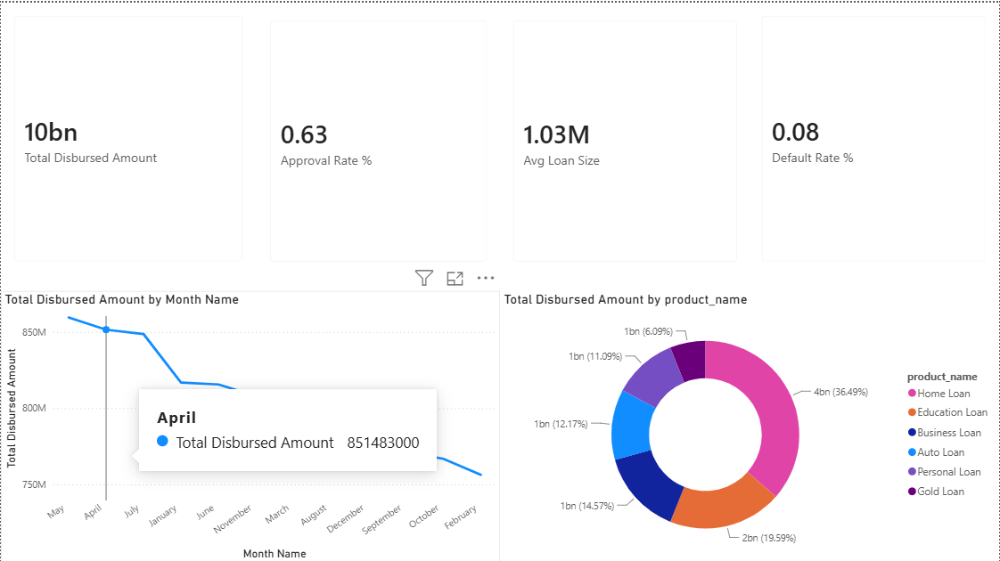

# Bank Loan & Credit Risk Analytics — India

## 🚀 Live Interactive Dashboard

**[View Dashboard →](https://malleshwaric.github.io/loan-risk-india/dashboard.html)**

Fully interactive — charts, tabs, KPI cards. No login required, opens in any browser.

---


> Credit risk analysis of a retail bank loan portfolio across India — covering approvals, defaults, NPA exposure, and repayment behaviour.



## Dashboard Highlights

| Metric | Value |
|---|---|
| Total Disbursed Amount | ₹10 Billion |
| Approval Rate | 63% |
| Average Loan Size | ₹1.03 Million |
| Default Rate | 8% |
| NPA Exposure | ₹1 Billion |
| On-Time Payment Rate | 80% |

## Project Overview

A retail bank wants to understand:
- Where loan applications are coming from and what's getting approved vs rejected
- Which customer segments and branches carry the highest default/NPA risk
- How credit score, income, and existing debt burden predict repayment behavior
- Repayment performance (on-time / late / missed) across customer occupation types

## Tech Stack

  

- **Python** (pandas, numpy, faker) — data generation and preprocessing
- **SQL** (MySQL/PostgreSQL-compatible) — schema design + analysis queries
- **Power BI** — 5-page interactive dashboard with 10 DAX measures

## Report Pages

| Page | Description |
|---|---|
| 1. Portfolio Overview | KPI cards, monthly disbursal trend, product mix donut |
| 2. Risk & Default | Default rate by risk category, NPA exposure by zone |
| 3. Repayment Behavior | On-time payment % and avg days late by occupation type |
| 4. Branch Performance | Disbursed amount by state, approval rate by zone |
| 5. Customer Analysis | Avg credit score by occupation, applications by product |

## Repository Structure

```
loan-risk-india/
├── data/
│   ├── branches.csv
│   ├── loan_products.csv
│   ├── customers.csv
│   ├── loan_applications.csv
│   └── loan_repayments.csv
├── python/
│   └── generate_data.py
├── sql/
│   ├── schema.sql
│   └── analysis_queries.sql
├── powerbi/
│   ├── DAX_Guide.md
│   └── Loan_Risk_India_Analytics.pbix
├── preview.png
└── README.md
```

## Data Model

5 tables, ~6,000 customers, ~15,000 loan applications, ~150,000 repayment records:

- **branches** — 55 branches across 5 zones (North/South/East/West/Central)
- **loan_products** — Home, Personal, Auto, Education, Gold, Business loans
- **customers** — demographics, income, CIBIL-style credit score (300–900)
- **loan_applications** — core fact table: amounts, tenure, EMI, status, risk category
- **loan_repayments** — monthly installment-level repayment history

## How to Run

```bash
# 1. Generate data
cd python
pip install faker numpy pandas
python generate_data.py

# 2. Load into SQL
mysql -u user -p db < ../sql/schema.sql

# 3. Open Power BI report
# Open powerbi/Loan_Risk_India_Analytics.pbix in Power BI Desktop
# Or follow powerbi/DAX_Guide.md to build from scratch
```

## Key Insights

- Home Loans dominate the portfolio at **36.49%** of total disbursed amount
- **High risk** category loans default at ~20% vs ~2% for Low risk
- **Maharashtra and Gujarat** lead in loan disbursement volume
- **South zone** has the highest approval rate across all zones
- **Business Owners** show the most late payment days on average

## About

Built by Malleshwari C · [GitHub](https://github.com/malleshwaric)
